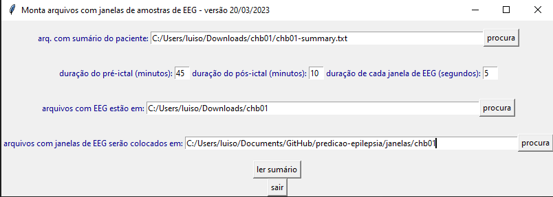

# Informações importantes:
Toda vez que baixar os arquivos, ler este documento para ver se algo foi modificado, alguma etapa de execução, alguma metodologia, para garantir o uso correto de todos os arquivos. Qualquer dúvida pode falar comigo: luisotaviolamorim@gmail.com.

Todas as bibliotecas utilizadas estão descritas no arquivo requirements.txt, para instalá-las automáticamente executar:

```
pip install -r requirements.txt
```

# Estrutura de pastas:
O diretório é organizado contendo duas pastas de códigos, alguns arquivos de código na raiz e diversas pastas de dados. Dentre as pastas de códigos há LSTM que realiza o treino e teste das redes neurais, e monta_arquivos que faz todo o processamento antes da execução das redes.

Já as pastas de dados são: sinais, janelas, vetores e sequências. Dentro de cada uma dessas pastas há uma pasta para cada um dos pacientes, contendo o seu identificador (chbxx). Todos os arquivos são armazenados no formato .parquet.

- Sinais: armazena os sinais do paciente após a passar pelo conversor.py (2ª etapa).

- Janelas: armazena as janelas de cada paciente após passar pelo montaArqsJanelas.py (3ª etapa).

- Vetores: armazena os vetores de cada um dos tipos do paciente. Exemplo: vetores/chb01/Corr (Vetores de correlação do paciente 1).

- Sequência: armazena as sequências de cada quantidade de vetores por sequências de cada tipo de vetor. Exemplo: vetores/chb01/15/Corr (Sequências contendo 15 vetores de correlação do paciente 1).


# 1ª Etapa: baixar os dados

Acessar o site https://physionet.org/content/chbmit/1.0.0/ e convertê-los para EDF utilizando o EDFbrowser

# 2ª Etapa: executar o arquivo de conversão

Para isso, em um terminal de linha de comando executar, aberto na pasta monta_arquivos/preprocessamento:

```
python /conversor.py -d {pasta}
```
Sendo que {pasta} é o caminho para o diretório em que os arquivos foram convertidos na 1ª etapa foram colocados.

O objetivo deste script é remover os canais inconsistentes e deixar para analisar apenas aqueles que foram utilizados por Tsiouris et. al:  FP1-F7, F7-T7 T7-P7, P7-O1, FP1-F3, F3-C3, C3-P3, P3-O1, FP2-F4, F4-C4, C4-P4, P4- O2, FP2-F8, F8-T8, T8-P8, P8-O2, FZ-CZ e CZ-PZ. Além disso ele apaga arquivos que o EDFbrowser cria, porém não são utilizados.

# 3ª Etapa: montar janelas a partir dos CSV
Execute monta_arquivos/preprocessamento/montaArqsJanelas.py, aberto na pasta monta_arquivos/preprocessamento. Assim, em um terminal de linha de comando executar:

```
python MontaArqsJanelas.py
```

Trata-se do código criado pelo professor Pires. Ele lê os arquivos txt convertidos na etapa anterior e cria as janelas interictais e pre-ictais. Quando executado abrirá uma tela para algumas entradas: caminho para o arquivo de sumário do paciente, caminho para a pasta onde estão os txts criados na etapa anterior e caminho para a pasta onde as janelas serão colocadas e outros valores que eu não modifico. Abaixo há o print da tela como exemplo.



Ao entrar com essas informações a janela passará a perguntar quais crises serão usadas para treino e quais para teste. Normalmente utilizamos apenas a última para teste e todas as outras para treino. Ainda assim há excessões, por exemplo o paciente 10 que devemos ignorar as últimas duas crises, usar a antepenúltima para teste, e o 11 que usamos a penúltima para teste.
Por fim, a mesma janela pergunta a proporção das crises, eu sempre coloco tanto de treino quanto de teste em 100%.

# 4ª Etapa: transformar arquivos .txt para .parquet.
Os arquivos no formato .txt ocupam muito espaço em disco, desta forma eu os armazeno em .parquet e os leio nesse mesmo formato para não lotar a minha memória. Assim, todos os códigos das próximas etapas esperam que os dados estejam neste formato, por isso eu faço essa nova conversão.

Para isso basta executar monta_arquivos/csv_para_parquet.py. Antes disso, modifique o arquivo para que na linha 6 esteja o paciente correto e a pasta correta (sinais ou janelas) e então execute, em um terminal de linha de comando, aberto na pasta monta_arquivos:

```
python csv_para_parquet.py
```

# 5ª Etapa: Criar vetores e sequências.
Para isso basta executar, em um terminal de linha de comando, aberto na raiz:

```
python janelas_para_sequencias.py

```

Este script vai olhar quais janelas estão disponíveis dentro da pasta janelas e perguntar ao qual delas serão utilizadas para a montagem das sequências. Isso é feito para que seja mais simples fazer o processo etapa a etapa, montar as janelas para todos os pacientes, armazená-las na mesma pasta (janelas/chb01, janelas/chb02, etc.). Ao selecionar o paciente, o código perguntará ainda se você deseja montar sequências misturando vetores, se responder que não, as janelas serão todas montadas com vetores sequênciais.

Ao responder essas duas peguntas, o calculo dos vetores e a montagem das janelas serão iniciados. Caso queira modificar quais tipos de vetores serão montados basta modificar a lista criada na linha 44, as opções são: 'Corr', 'Wavelets', 'FFT', 'Grafos' e 'Estatisticos'. Caso queira modificar as quantidades de vetores por sequências basta editar a lista criada na linha 41. 

Este script executa os arquivos monta_arquivos/montaVets{tipo}.py para os tipos colocados na lista mencionada acima. 

Atenção: os arquivos de montagem de vetores para vetores de Correlação e Wavelets são feitos para executar essa criação de forma paralelizada, já que é uma tarefa demorada. Na configuração atual será aberto um processo para cada thread do computador executando (no meu computador há 4 núcleos com 2 threads cada, então serão 8 processos), isso pode consumir bastante memória RAM e bastante poder de processamento, deixo desta forma para colocar e deixar o computador fazendo apenas isso.

Para diminuir a quantidade de processos ou mesmo remover a paralelização basta modificar o parâmetro max_workers na função concurrent.futures.ProcessPoolExecutor, caso queria remover a paralelização coloque esse parâmetro em 1, caso queira diminuir a quantidade de processos, aumente o valor que está dividindo a variavel multiprocessing.cpu_count(). Por exemplo, caso coloque: max_workers=int(multiprocessing.cpu_count() / 3) será criada uma quantidade de processos aproximadamente igual à um terço da quantidade de threads disponíveis.

Você pode mudar isso na linha 57 de monta_arquivos/montaVetsWavelets.py e na linha 84 de monta_arquivos/montaVetsCorr.py.

Outro detalhe importante, é muito provavel que ocorra alguns avisos na montagem dos vetores de correlação, isso não é um problema, pode ignorar. O que acontece é que em algum momento no cálculo das correlações há uma divisão por 0, por isso o aviso aparece, porém no código isso já é tratado. Essa divisão por zero ocorre quando o desvio padrão de um dos dois sinais é nulo já que a correlação é definida, pela biblioteca como mostra a equação abaixo. 

$$
corr(x,y) = \frac{cov(x, y)}{\sigma(x)\sigma(y)}
$$ 

Porém, quando o desvio padrão de um dos dois sinais é nulo, significa que aquele sinal em si é constante, sendo constante, a correlação é nula, assim, no código, esse caso é tratado ao zerar os valores em que essa divisão por zero ocorre. 

# 6ª Etapa: execução do treino e teste das redes
Esta é a etapa final, a da rede neural. Na pasta LSTM há dois arquivos: lst_novo.py, e roda_tudo.py. O primeiro, recebem como parâmetro de entrada uma pasta contendo arquivos de sequências e uma flaga que indica se é para embaralhar sequências de treino e teste (método tsiouris) e realiza o treino e teste dessas redes. Assim, deve-se executar em um terminal de linha de comando já na pasta LSTM:

```
python roda_tudo.py
```

Ao fazer isso, as redes serão treinadas e os resultados serão armazenados nos diferentes arquivos. Porém, antes de fazer é interessante modificar 4 a 8 deste arquivo para selecionar quais combinações são desejadas.

- Linha 4: número do primeiro paciente a ser executado
- Linha 5: número do último paciente a ser executado 
- Linha 6: executar método tsiouris
- Linha 7: executar método recomendado
- Linha 8: tipos de vetores a serem usados como entradas
- Linha 9: quantidade de vetores por sequência de entrada

Assim, na forma padrão, como está configurado na pasta do drive, será treinada e testada redes para o paciente 1, para os vetores de wavelets e para os de correlação, para 15, 30, 45 e 60 vetores por sequência, o mesmo para o 2 paciente. Desta forma, ocorrerão 16 treinos e testes de redes LSTM.
